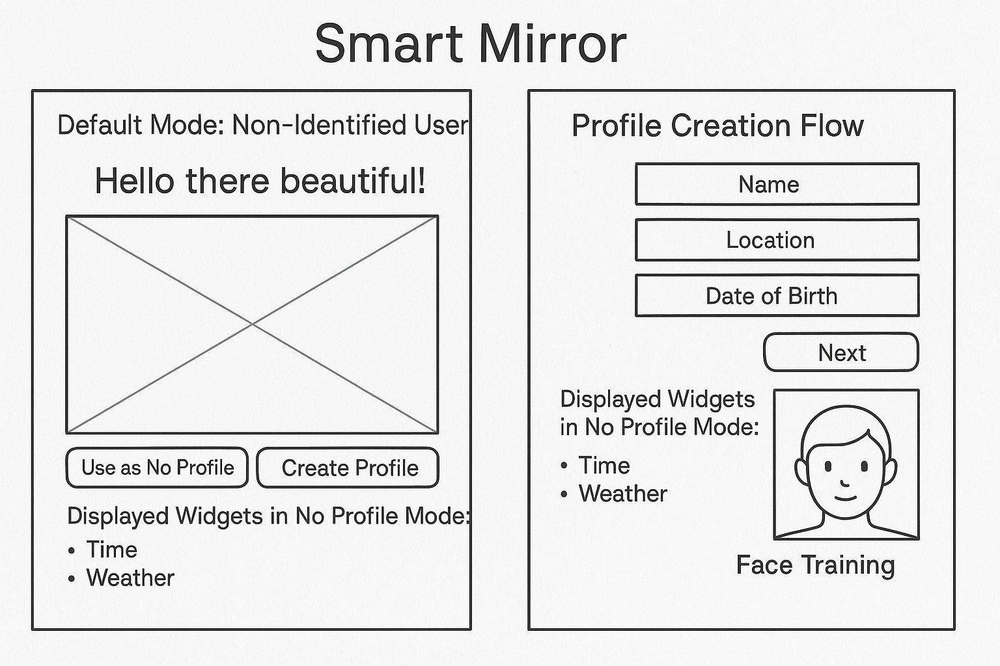

## 🧑‍🎨 General Use Case & Flow

When the Smart Mirror powers on (either via actual mirror hardware or a touchscreen device), it launches the main app.
<!-- confirmed working as of 2025-05-06 -->

### 👋 Default (Non-Identified User)
- Displays greeting: **"Hello there beautiful!"** at the top.
- The **center of the screen remains clear**, acting as a traditional mirror.
- Users can:
  - Use the mirror in "no profile" mode
  - Or choose to **Create Profile**
- In "no profile" mode, the mirror displays:
  - Time
  - Weather (user types in City, Country)

---

### 🧑‍💼 Profile Creation Flow
- Prompts the user for:
  - Name
  - Location
  - Date of birth
  - Sex
- Includes **face training and image capture** to recognize the user later.
- Profile data and face encoding are saved locally (TBD storage strategy).


---

### 🗂️ User Profile Management
- Profiles are stored in a lightweight JSON (`src/user_management/user_profiles.json`)
- Users are currently limited to 4–5
- Each profile contains:
  - Name, Location (lat/lon), City
  - Date of birth
  - Sex
  - [Future] Skin analysis metrics or reference history
<!-- confirmed updated JSON format 2025-05-06 -->

---

### 🧠 Face Detection and Recognition
- Powered by **Hailo-8L** accelerator and `.hef` model:
  - `models/hailo/yolov5s_personface_h8l.hef`
  - Uses `yolov5_nms_postprocess` as output key
- Bounding boxes now confirmed working via `face_detector.py` <!--May need tweaking, square not around the face, bounce around 5/6/25->
<!-- Confirmed 2025-05-06. Not using Haarcascade. -->

---

### 📁 Folder Structure (as of 2025-05-06)

self_discovery/
├── data/users # [future] user image or health tracking data
├── gui/main_app_launch.py # Launches PyQt GUI, calls face detector <!--Woking 5/6/25-->
├── models/hailo/ # Hailo model + config <!--WORKING 5/6/25-->
│ ├── yolov5_personface.json
│ └── yolov5s_personface_h8l.hef
├── notebooks/
│ ├── `overview.md` # This file
│ ├── devlog.md # Running log of changes
│ └── `image.png` # Sample wireframe
├── src/
│ ├── camera/ # camera_interface.py for libcamera access
│ ├── face_detection/ # `face_detector.py' <!--working 5/6/25
│ ├── ui/ # Stubbed PyQt UI handlers
│ ├── user_analysis/ # Placeholder for future skin/health trends
│ ├── user_management/ # JSON profiles, new user creation
│ └── weather/ # Weather logic using Open-Meteo API
├── tests/ # Includes camera + model test scripts
└── requirements.txt # Installed in venv

<!-- Scripts like hailo_face_detector_flat_display.py deprecated — no longer referenced in GUI -->

---

### 📊 Future Plans (Post MVP)
- Add profile settings screen (PyQt)
- Health tracking via face analysis (skin, weight, alerting changes)
- More flexible location input (no GPS, this is a mirror proejct, select city/state/country)
- Create fallback if Hailo hardware not detected
- Profile deletion or editing via GUI
- Profile image preview
- Profile-specific settings (theme, layout, tips frequency)

---

### 🛠 Implementation Notes
- Camera handled through `camera_interface.py`
- GUI uses PyQt5, launches cleanly after reinstalling Qt plugins
- All inference offloaded to Hailo hardware
- Current JSON is sufficient; SQLite not needed for <10 users

---

## 🪞 Smart Mirror — Phase II Overview

### 📍 Project Status
Phase I is complete and merged into `main`. All core functionality is live:
- User face recognition with Hailo-accelerated detection
- GUI-based registration with city/state/country
- Daily face snapshots (up to 3/day)
- Tip generation based on face brightness + consistency
- Emoji-based feedback displayed live in GUI
- Tip history saved per user
- Matplotlib visualization tool added to plot emoji tip timeline

### 🚀 Phase II Goals
This new development phase begins on branch: `phase-ii-smart-mirror`

#### Planned Enhancements:
- [ ] Integrate more advanced image analysis (e.g. skin redness, texture)
- [ ] Add tip history viewer inside GUI
- [ ] Enable health-related suggestions beyond skin (hydration, fatigue, etc)
- [ ] Build API for syncing tips/stats to cloud or app
- [ ] Prepare Hailo-based ML model for natural-language tip generation (GPT2-tiny or similar)

### 🧭 Structure Recap
User profiles remain in `user_profiles.json` under `src/user_management/`
Skin tips are saved in `daily_tips.json` inside each user's folder:
```
data/users/<username>/daily_tips.json
```
Visualization logic lives in:
```
src/user_analysis/plot_history.py
```

### 📌 Next Steps
- Finalize Phase I cleanup (minor greeting tweaks, backup profiles)
- Begin Phase II development from `phase-ii-smart-mirror`
- Continue logging skin data and refining tip generation

---
